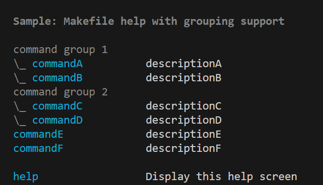

# Makefileのhelpを表示する奴のグループ分け表示対応版

  

Makefile helpで検索するとよく出てくる奴のグループ分け表示に対応したバージョンです．  
awkプログラムが複雑化しhelpのコマンドがワンライナーとしては長大になってしまったためawkファイルに分割しています．  
使用する場合はご了承くださいませ．

## usage

[Makefileのサンプルを参照](./Makefile)

Makefile内のhelp部分をコピペしてください．`mfhelp.awk`ファイルをMakefileと同階層に入れてください．

### コマンドの説明コメント

よくある奴です．
`command: ## description`

### グループコメント

`###>`がグループ分け関連のコメント記法です．記述行の先頭に配置してください．
- `###> [command group comment]`でグループコメントを記述できます．
    - 同時に以降のコマンド行がグループ表示モードになります．
- `###> @`で始めると以降のグループ表示モードを停止できます．同じ行のコメントは表示されません．
- `###>`単体は改行として機能します．
    - この場合グループ表示モードは`###> @`と同様に停止されます．

>[!NOTE]
>コマンドとその説明が表示される行をコマンド行と呼称しています．  
>`\_ `が行頭に付く場合をグループ表示モードと呼称しています．

#### コマンド行の幅の変更

helpのawkコマンドの最後に`cmdw=<width>`を追記してください．このとき`-v`オプションは使用しないでください．
